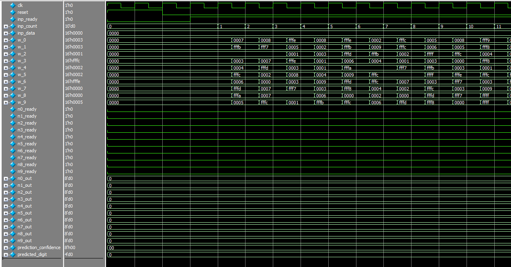

# MNIST Neural Network on FPGA (Q8.8 Fixed-Point Inference)

This project implements a single-layer, fully-connected neural network for classifying MNIST digits (0–9) on an FPGA. It is written in Verilog and uses Q8.8 fixed-point math with a lookup table (ROM) for sigmoid activation. The network computes predictions in real-time and outputs both the predicted digit and its confidence.

## Main Files

**neuron.v** : Implements a single neuron with multiply-accumulate logic and sigmoid activation using a ROM.

**mnist_nn.v** : Top-level module that connects 10 neurons, processes 784 input pixels, and outputs the predicted digit and confidence.

**sigmoid_mem.v**: ROM-based lookup table for sigmoid function values in Q0.8 format.

**weight_memX.v**: 10 ROMs containing weights for the 10 neurons.

**mnist_nn_tb.v** : Testbench file for simulation, which reads input data from a hex file and checks output results.

**neuron_tb.sv** : Testbench file for testing the neuron module. Outputs the final MAC value and sigmoid result.

## Architecture

### Input

- 784 normalized pixel values (28x28 image), streamed serially (one per clock when inp_rdy = 1).

### Neuron Logic (neuron.v)
- Multiplies each pixel with a weight (Q8.8 × Q8.8 → Q16.16).
- Accumulates over 784 cycles.
- Adds a fixed bias obtained from training.
- Applies a sigmoid activation using a ROM (clamped to input range [–16, +15]).
- Returns an 8-bit sigmoid output (q0.8) and pulses sigmoid_ready.

### Top-Level Inference (mnist_nn.v)
- Connects all 10 neurons (for digits 0–9).
- Loads weight values from 10 separate ROMs (weight_mem0 – weight_mem9).
- Collects all 10 sigmoid outputs and determines:
    - predicted_digit: the index of the neuron with the highest activation.
    - prediction_confidence: the max sigmoid output among all neurons.

### Data Format
| Signal                 | Type         | Format          | Description                         |
|------------------------|--------------|------------------|-------------------------------------|
| `inp_data`            | Input        | Q8.8 signed      | Pixel intensity (normalized [0,1])  |
| `weight`, `bias`      | Input        | Q8.8 signed      | Learned weights and neuron biases   |
| `acc`, `acc_final`    | Internal     | Q16.16 signed    | Accumulation result                 |
| `sigmoid_out`         | Output       | Q0.8 unsigned    | Output of sigmoid activation        |
| `predicted_digit`     | Output       | uint4            | Predicted label (0–9)               |
| `prediction_confidence` | Output     | Q0.8 unsigned    | Confidence of prediction            |

 

 ## Testing

### neuron_tb.sv – Neuron Module Testbench
This testbench is used to verify the internal logic of a single neuron module. It provides direct control over:
- Input data (inp_data)
- Weights (weight)
- Bias (bias)

- The testbench monitors:
    - product_q16_16 – the result of input × weight
    - acc and acc_final – the accumulation before and after adding bias
    - sigmoid_address – the address used to index into the sigmoid ROM
    - sigmoid_out – the final 8-bit Q0.8 output after activation
    - sigmoid_ready – signal that pulses when output is valid

### mnist_nn_tb.v – Top-Level Testbench
This testbench simulates the  inference pipeline for one MNIST image. It performs the following tasks:
- Loads input data from a .hex file containing 784 Q8.8-formatted pixel values
- Feeds one pixel per cycle into the network through inp_data when inp_rdy = 1.
- Waits for all 10 neurons to complete processing (using *_ready signals).
- Captures the outputs, predicted_digit and prediction_confidence.

